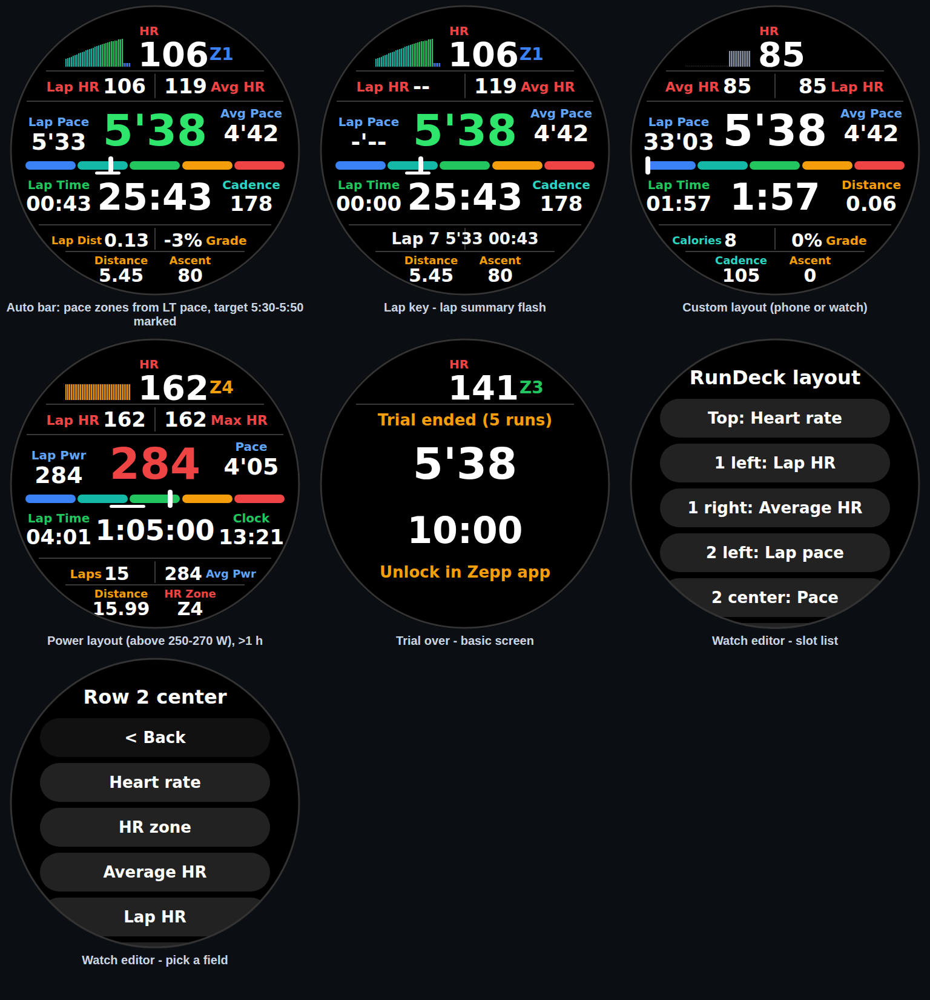

# RunDeck — one-screen running dashboard for Amazfit (Zepp OS)

A **Zepp OS Workout Extension** that pins a dense, glanceable data screen inside the native
Amazfit running workout: HR with a live zone-colored history graph, lap vs average HR and
pace around a big center pace (or power), a five-zone bar, elapsed time, cadence, lap
distance, grade, distance and total ascent — all on one page.

The native workout keeps GPS, recording, laps and the activity file; RunDeck only reads
native data and renders it.



Icon options (the shipped one is D): [docs/icons/options.png](docs/icons/options.png) — copy
any `docs/icons/*.png` over `assets/common.r/icon.png` to switch (`node docs/icons/gen.mjs`
regenerates them).

## The screen

```
        [HR graph, last 6 min]  106 Z1
      Lap HR 105   │   117 Avg HR
 Lap Pace        5'38         Avg Pace       <- center: pace or power, colored vs target
   4'52                         4'42
 ▬▬▬▬▬▬▬▮▬▬▬▬▬▬▬▬▬▬▬▬▬▬▬▬▬▬▬▬▬▬▬▬           <- zone bar: HR, pace or power zones
 Lap Time        33:34        Cadence
   00:43                         178
      Lap Dist 0.14  │  -3% Grade           <- also where lap / trial notices flash
        Distance 7.14   Ascent 115
```

| Field | Source |
|---|---|
| HR | HeartRate sensor (`data:user.hd.heart_rate`) |
| Pace, distance, elapsed, cadence, avg pace, total ascent, altitude | native `getSportData` (`pace`, `distance`, `duration`, `cadence`, `avg_pace`, `total_up_altitude`, `altitude`) |
| Power | `getSportData("power")` — **not in the documented types**, probed only when power is shown |
| Lap HR / pace / time / distance, avg HR, HR graph, grade | computed in `shared/stats.js` from the native samples, driven by the native elapsed clock (a paused workout accumulates nothing) |

### Customizing the screen

The screen is a top row plus five rows and the zone bar. Each row has a **column count**
(top row: 1–2, rows 1 and 4: 2–3, the big-number rows 2 and 3: 1–3, bottom row: 1–2; the
limits keep text readable on the round screen). HR as the single top value gets the
6-minute graph and a zone suffix; in a two-column top row the zone moves into its label
("HR Z3", zone-colored). Any of 41 fields can go in any spot — HR, HR zone,
avg/lap/max HR, pace, avg/lap/last-lap pace, speed, power, avg/lap power, workout time, lap
time, clock, distance, lap distance, lap count, grade, ascent, altitude, cadence, avg
cadence, calories, or empty. Text shrinks to fit its spot.

**Native-only fields** — descent, lap ascent/descent, max altitude, vertical speed, max
speed, stride length (current/avg), steps, % max HR, % HR reserve, aerobic/anaerobic
training effect, training load, temperature, sunset — are values the watch computes but
does not hand to extensions. RunDeck places a `SPORT_DATA` widget (the watch draws the
value itself, in its own units) over the slot and adds its own label. GAP, vertical
oscillation and ground contact time are not exposed by Zepp OS at all, so they can't be
shown.

**Field names** can be full text, short text ("LapHR") or **icons** with a qualifier
("♥ Avg"); icons live in `assets/common.r/icons/{20,26}` (`node sim/gen-icons.mjs`).

Two places to edit, one layout:

- **Phone:** Zepp app → RunDeck settings → *Screen layout* (a picker per slot + zone bar).
- **Watch:** open RunDeck from the watch's app list → tap a slot → tap a field.

Both write the same layout with an `updated_at` stamp; the newer copy wins in both
directions (watch edits reach the phone on the next sync, `LAYOUT_UPDATE`). Only the native
channels the layout shows are polled (calories, average cadence and power are skipped when
nothing displays them).

Other settings: pace unit, auto-lap (1 km|mi or off), a **pace, power or heart rate
target** entered as From / To (one end alone = a single value ± tolerance; each metric
keeps its own range; every slot showing that live value turns green/blue/red), HR zones,
threshold pace and FTP.

**Zone bar:** *Auto* (default) follows the target — power zones from FTP / critical power
for a power target, pace zones from LT pace for a pace target, HR zones otherwise — and
marks the target range as a white strip under the bar. HR / pace / power / off can be
forced. Zepp OS gives extensions no access to planned structured workouts (the `Workout`
sensor only exposes status, history, HR zone settings and route navigation), so the bar
cannot follow workout steps.

**HR zones** default to **the watch's own zones** (`Workout.getUserHrZoneSettings`, Zepp OS
4.2+). Older firmware falls back to 220 − age from the Zepp profile (`data:user.info`), then
max HR 190. Max HR %, threshold HR (Friel) or custom bounds can be picked instead.

**Laps:** the lap key closes a RunDeck lap *and* the native lap. Native auto-laps are not
visible to extensions, so RunDeck runs its own auto-lap — set the watch's auto-lap to the
same distance (or off) to keep both in step.

## Trial and license

- **5 free runs.** A run counts once it passes 5 minutes of native time, once per activity;
  reopening the screen in the same activity is recognized and never costs a run
  (`shared/trial.js`). The run that uses up the trial finishes on the full screen.
- After that the screen drops to **basic mode** (HR, pace, time, distance + "Unlock in Zepp
  app"). It never locks mid-run, and a license that arrives mid-run unlocks immediately.
- The count lives on the watch and is mirrored to the phone (max wins). It is not
  tamper-proof: the watch code is plain JavaScript, so the goal is "paying is easier than
  cracking", not DRM.
- **Unlock:** €6 one-time through [Polar.sh](https://polar.sh) (merchant of record). The
  buyer gets a license key by e-mail, pastes it into the RunDeck settings; the phone side
  service activates it against Polar's public license endpoint (no RunDeck server) and pushes
  the unlock to the watch. Granted keys are re-validated weekly when online; offline the
  unlock simply stays. Clearing the key deactivates it so it can move to another watch.

### Why Polar.sh (researched 2026-09)

| | Polar.sh | Lemon Squeezy | Gumroad | Paddle |
|---|---|---|---|---|
| Merchant of record (EU VAT handled) | yes | yes | yes | yes |
| License keys with a **public** activate/validate API (callable from the phone, no server) | yes | yes | verify only | no — needs your own key server |
| Fee on a €6 sale | 5% + $0.50 (new orgs, since May 2026) | 5% + 50¢ | 10% + $0.50 + card processing | 5% + 50¢ |
| Platform risk | active, open source | being migrated into Stripe Managed Payments | stable | stable |

Lemon Squeezy was the other real candidate, but it is being folded into Stripe Managed
Payments, which does not carry over all of Lemon Squeezy's features — the wrong time to
start on it. Gumroad takes roughly twice the cut on a €6 sale.

Rough net per sale: €6 − ~€0.75 Polar fee (more on international cards) − VAT if the price is
VAT-inclusive (e.g. 21% CZ) ≈ **€4–5**, before payout fees ($2/month in payout months +
0.25%). Check Polar's price/tax settings before publishing.

### Polar setup (one-time, needed before release)

1. Create an organization on polar.sh (test first on `sandbox.polar.sh`).
2. Create a product **RunDeck** (done: checkout link in `BUY_URL`), one-time price **€6**, with a **License Keys** benefit:
   activation limit 3 (one person, a couple of watches), no expiry.
3. Organization id and checkout link are set in `shared/license.js`. For sandbox testing
   pass `api: POLAR_SANDBOX_API`.

## Project layout

| Path | What |
|---|---|
| `data-widget/common/index.js` | the screen: tick loop, rendering, lap key, trial/license gating |
| `data-widget/common/index.r.layout.js` | 480px round layout (px()-scaled) |
| `data-widget/common/metrics.js` | native data reader with battery-aware polling |
| `data-widget/common/hr-zones.js` | watch HR zones → age → default fallback chain |
| `page/index.js` | on-watch layout editor (app list entry) |
| `shared/fields.js` | field catalog, slots, layout model and merge rule |
| `app.js` | receives phone pushes (config/license) for the whole mini program |
| `app-side/index.js` | phone side service: config build, Polar activation, trial mirror |
| `setting/index.js` | Zepp app settings page |
| `shared/` | platform-free logic (stats, zones, target, trial, license, config, format) |
| `sim/`, `tests/` | headless Zepp OS stubs, preview renderer, Node tests |

## Develop

```
npm install
npm test              # 100 tests: logic + the real widget/side service against stubs
npm run preview       # renders sim/out/preview.html
npm run screenshots   # regenerates docs/ui-preview.png and docs/screenshots/
```

**`.js` vs `.mjs`:** `zeus build` compiles *every* `.js` file in the project to ES2015,
imported or not (its ignore list is fixed: dot-folders, `dist/`, `node_modules/`). So `.js`
is only for code that runs on the watch or phone (`app.js`, `app-side/`, `setting/`, `page/`,
`data-widget/`, `shared/`); tests, the simulator and the site build are `.mjs`.
`tests/zeus-build.test.mjs` fails if a stray `.js` file appears.

Device: install the Zeus CLI (`npm i -g @zeppos/zeus-cli`) (`appId` 1128268), run
`npm install` in this folder first (zeus bundles `@zeppos/zml` from `node_modules`; without it
the build warns "could not be resolved – treating it as an external dependency" and every
page opens black on the watch), then
`zeus preview` and scan the QR code in the Zepp app (developer mode). Requires Zepp OS 3.6+
(workout-extension watches: T-Rex 3, Balance 2, Active 2, Cheetah family, ...).

Logs from the watch: enable developer mode in the Zepp app (Profile → Settings → About, tap
the Zepp logo repeatedly), switch on **Bridge**, then run `zeus bridge` → `connect` →
`install`; `console.log` output streams to that terminal. `zeus dev` (simulator) shows the
console as well.

## Landing page

`site/template.html` → `node site/build.mjs` → `site/index.html` (+ `site/privacy.html`,
rendered from `PRIVACY.md`): a single static page that
inlines the simulator's real watch frames (`docs/screenshots/*.svg`), the field list and the
Polar checkout link. `.github/workflows/pages.yml` deploys it to GitHub Pages on pushes to
`main` (Settings → Pages → Source: GitHub Actions; free only for public repositories).

## Needs on-device verification

- The layout editor page: that RunDeck shows up in the watch's app list with a page module,
  that `setScrollMode` scrolls the long lists, and that button text fits.
- `getUserHrZoneSettings` on a 4.2+ watch, and the age fallback on an older one.
- `getSportData` for `calories` and `avg_cadence`.

- Real font widths: the preview renders with DejaVu Sans Bold, which is wider than the
  watch font, so the device should have *more* room than the screenshots — but check the
  two-column rows and a 1 h+ elapsed time.
- `getSportData` shapes for `avg_pace`, `altitude`, `total_up_altitude` and whether the
  undocumented `power` channel answers with a Stryd paired.
- Battery: 5 IPC reads/s plus the widget updates, versus Intervals Guide's budget.
- The settings page `Link` and the side-service `fetch` POST with a JSON body against Polar.
- Whether the zone bar marker reads well in sunlight at 8 px.

## License

RunDeck is paid, **source-available** software — not open source. The code is public so
it can be read and reviewed; building, installing or distributing your own copy, or
bypassing the trial or license check, is not permitted. See [LICENSE](LICENSE).
